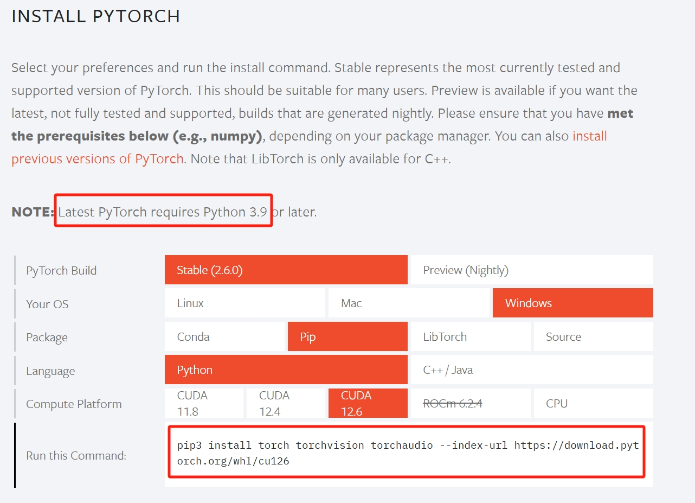
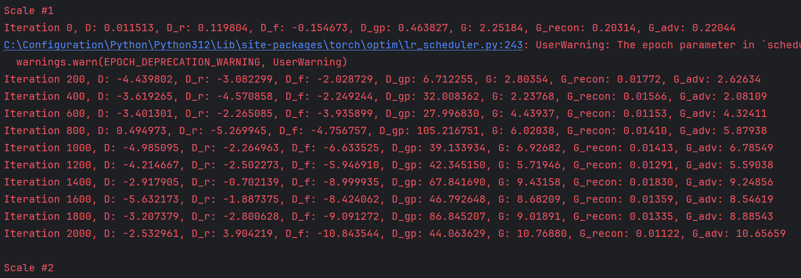
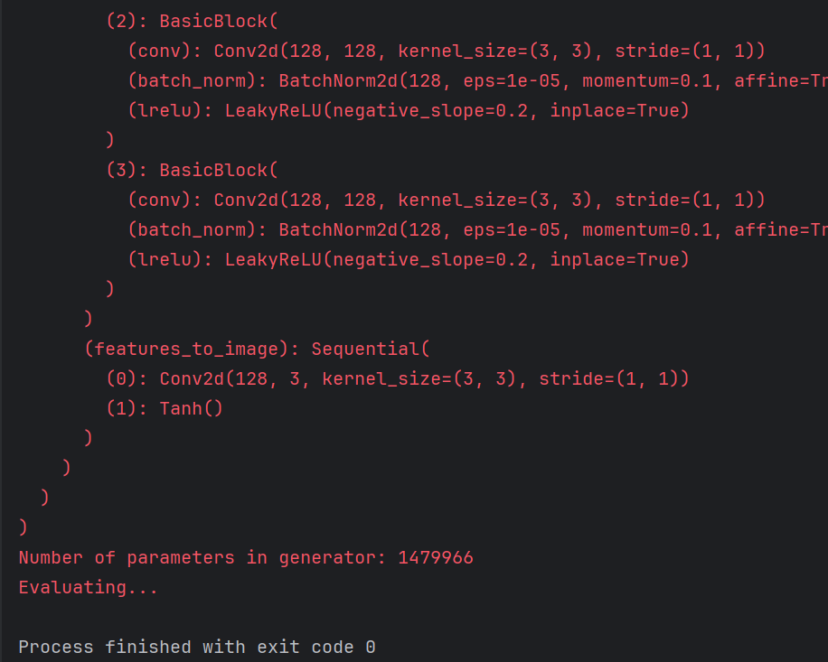
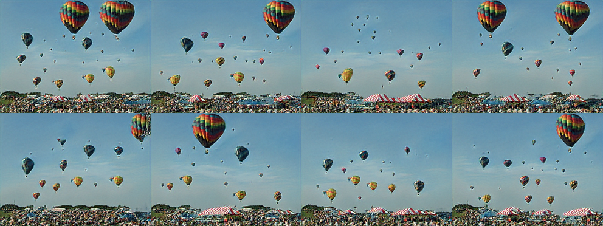

# SynthView

LU CDS525 Project SynthView Team

# CDS525 Practical App of Deep Learning

Director: Prof. DONG

Project: generate similar images from single image using GAN.

| Student No. | English Name  | Email Address (Lingnan Email) |
|-------------|---------------|-------------------------------|
| 3160708     | LUO Suhai     | suhailuo@ln.hk                |
| 3160320     | LI Junrong    | junrongli@ln.hk               |
| 3160148     | YAO HaoYang   | hyao@ln.hk                    |
| 3160617     | HUANG Xinghua | xinghuahuang@ln.hk            |
| 1165950     | MA Xiaorui    | xiaoruima@ln.hk               |
| 1179248     | CHAI Yaping   | yapingchai@ln.hk              |

# Clone repository

```commandline
git clone https://github.com/RockyRori/SynthView
cd ./SynthView
```

# Install dependencies

```commandline
python -m pip install -r ./requirements.txt
```

# Set project source

If you use **pycharm** then right click folder generation and choose the down most mark directory as sources root.
This step make sure the dependencies in utils work, **otherwise** you can set your project root to folder generation
instead of SynthView.
In this way you will need to modify the following command line as well.

# prerequisite

## Assure CUDA available

```commandline
nvidia-smi
```

## Sample Result

+-----------------------------------------------------------------------------------------+
| NVIDIA-SMI 566.03 Driver Version: 566.03 CUDA Version: 12.7 |
|-----------------------------------------+------------------------+----------------------+
| GPU Name Driver-Model | Bus-Id Disp.A | Volatile Uncorr. ECC |
| Fan Temp Perf Pwr:Usage/Cap | Memory-Usage | GPU-Util Compute M. |
| | | MIG M. |
|=========================================+========================+======================|
| 0 NVIDIA GeForce RTX 4080 ... WDDM | 00000000:01:00.0 Off | N/A |
| N/A 55C P0 31W / 155W | 0MiB / 12282MiB | 0% Default |
| | | N/A |
+-----------------------------------------+------------------------+----------------------+

## uninstall pytorch

check pytorch type

```python
import torch

print(torch.cuda.is_available())
```

If True skip., otherwise do the following

```commandline
pip uninstall torch
```

## install pytorch with cuda

official website to see

https://pytorch.org/

choose appropriate pytorch version and download


# Training

upload your target to images for example balloons.png

```commandline
python .\generation\main.py --root .\images\balloons.png
```

python3 main.py --root <path-to-image>

* \<path-to-image\>

run the previous command you will see


# Evaluating

test your result
!!!not yet finished

```commandline
python .\generation\main.py --root .\images\balloons.png --evaluation --model-to-load .\results\2025-02-26_11-17-13\g_multivanilla.pt --amps-to-load .\results\2025-02-26_11-17-13\amps.pt --num-steps 100 --batch-size 16
```

python3 main.py --root <path-to-image> --evaluation --model-to-load <path-to-model-pt> --amps-to-load <path-to-amp-pt>
--num-steps <number-of-samples> --batch-size <number-of-images-in-batch>

* \<path-to-image\>
* \<path-to-model-pt\>
* \<path-to-amp-pt\>
* \<number-of-samples\>
* \<number-of-images-in-batch\>

run the previous command you will see


# Check generated picture

at the same hierarchy you will find a results folder containing everything.


# Reference

https://arxiv.org/pdf/1905.01164

# Division of labor

1.结果展示：录制视频和写PPT
2.文档写作：写proposal和final report
3.模型训练与优化：训练模型和编写包含清晰英文注释的代码
4.数据收集与预处理：提供可用的数据集，每节课提醒Quiz时间。
5.原理解读：写技术文档和数学公式，参考群里的链接
6.模型比较：比较组内几个模型的效果，用数学指标评价我们的模型

| English Name  | Division |
|---------------|----------|
| LUO Suhai     | 写代码，模型比较 |
| LI Junrong    | 待定       |
| YAO HaoYang   | 待定       |
| HUANG Xinghua | 待定       |
| MA Xiaorui    | 原理解读     |
| CHAI Yaping   | 模型训练     |
结果展示：录制视频和写PPT；文档写作：写proposal和final report；数据收集与预处理：提供可用的数据集，每节课提醒Quiz时间。
每个人首先下载代码然后成功运行。每个人从这里面选择一个主题作为演讲的时候自己的主题。按照表格的分工完成任务，最好是月底完成。
(1)Model principle
(2)Loss Function
(3)Optimizer
(4)Other Hyperparameters (e.g., batch size, learning rate, number of epochs)
(5)Fine-tuning and pre-training (for large language/Transformer model)
(6)Model evaluation
(7)Model Comparison